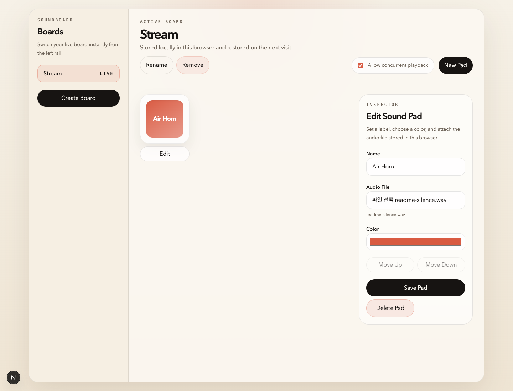
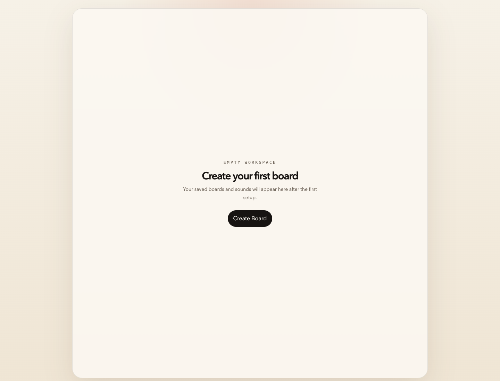

# Soundboard

Soundboard is a browser-based soundboard for triggering short audio effects from a grid of pads, similar to a lightweight web streamer deck. It is designed to run without a backend: boards, pad settings, and uploaded audio files are stored locally in the browser and restored when the same user revisits the app on the same device and browser.

The project is currently built with Next.js and deployed to Cloudflare Workers through OpenNext. The primary audience for this repository is developers who want to understand, run, extend, or self-host the app.

## Features

- Multiple boards with persistent selection state
- Board creation, inline renaming, and deletion
- Confirmation before deleting boards that still contain pads
- Pad creation, editing, deletion, and manual reordering
- Dedicated settings dialog for playback behavior and browser output state
- Default pad volume plus per-pad volume overrides
- Local audio file upload with browser-side validation
- Browser-native audio playback with optional concurrent playback
- Optional `Stop All` control for currently active playback
- Progressive-enhancement audio output routing where browser support exists
- Inspector workflow that keeps editing in-page instead of navigating away
- IndexedDB persistence for boards, pads, settings, and audio blobs

## Screenshots

Board view:



Empty workspace:



## Tech Stack

Core runtime and framework versions currently used in this repository:

- Next.js `16.2.1`
- React `19.2.4`
- React DOM `19.2.4`
- TypeScript `5.9.3`
- Tailwind CSS `4.2.2`
- Node.js `24.13.0`
- pnpm `10.28.0`
- Wrangler `4.76.0`
- OpenNext Cloudflare `1.17.3`
- Vitest `4.1.1`

## Quick Start

### Prerequisites

- Node.js `24.13.0`
- pnpm `10.28.0`

### Install dependencies

```bash
pnpm install
```

### Start local development

```bash
pnpm dev
```

Then open [http://localhost:3000](http://localhost:3000).

## Available Scripts

```bash
pnpm dev
pnpm build
pnpm start
pnpm test
pnpm test:coverage
pnpm lint
pnpm preview
pnpm deploy
```

What they do:

- `pnpm dev`: run the Next.js development server
- `pnpm build`: build the app with Next.js
- `pnpm start`: start the production Next.js server locally
- `pnpm test`: run the Vitest suite
- `pnpm test:coverage`: run the Vitest suite with V8 coverage reporting
- `pnpm lint`: run ESLint
- `pnpm preview`: build with OpenNext and start a Cloudflare-style preview
- `pnpm deploy`: build with OpenNext and deploy through Wrangler

## Verification

Before merging changes, the expected local verification flow is:

```bash
pnpm test
pnpm lint
pnpm build
pnpm exec opennextjs-cloudflare build
```

This covers application behavior, linting, Next.js production output, and the OpenNext bundle used for Cloudflare Workers.

When you need a coverage report for local analysis, run:

```bash
pnpm test:coverage
```

## Browser Support

This project is intended to work on current desktop releases of:

- Chrome
- Edge
- Firefox
- Safari

Mobile browsers are best-effort only. Because the app depends on IndexedDB, `Blob` storage, and browser-managed audio playback, quota limits and playback policies can still vary by browser version and device.

Audio output device routing is treated as a progressive enhancement feature. The settings UI is available everywhere, but choosing a specific output device depends on browser support for related media APIs and may still require a secure context and direct user interaction.

If you find a browser-specific issue, open a bug report and include the exact browser version and operating system.

## Deployment

This repository is configured for Cloudflare Workers using OpenNext.

Typical deployment setup:

1. Connect the repository to Cloudflare Workers Builds.
2. Use `main` as the production branch.
3. Set the build command to:

```bash
pnpm exec opennextjs-cloudflare build
```

4. Set the deploy command to:

```bash
pnpm exec opennextjs-cloudflare deploy
```

Important:

- Review `wrangler.jsonc` before deploying your own fork.
- Worker names, routes, and domain-related settings are project-specific and should be updated for your environment.
- `main` is intended to be the only branch that auto-deploys in the current workflow.

## Project Structure

```text
app/                         Next.js App Router entry points
components/soundboard/       UI components for boards, pads, settings, and inspector
lib/soundboard/              IndexedDB, audio playback, defaults, types, and validation
.github/                     CI workflow, issue forms, and PR template
tests/components/            Component-level tests
tests/lib/                   Unit tests for local soundboard modules
docs/assets/                 README screenshots
docs/architecture.md         Public architecture and persistence overview
CONTRIBUTING.md              Contribution workflow and review expectations
wrangler.jsonc               Cloudflare Workers configuration
open-next.config.ts          OpenNext configuration
```

## Data Model and Persistence

This project does not use a backend.

Persistent data is stored in IndexedDB through `lib/soundboard/db.ts`. The main stores are:

- `boards`
- `pads`
- `settings`

Uploaded audio files are stored as `Blob` values in IndexedDB. Persistence is intentionally scoped to the same browser on the same device. There is no built-in sync across devices or browsers.

Persisted settings currently include:

- active board selection
- concurrent playback mode
- default pad volume
- `Stop All` button visibility
- preferred audio output device metadata when supported

Pads may also store a pad-specific `volumeOverride` value. When it is `null`, the pad falls back to the global default volume.

Browser storage limits still apply. Large or numerous audio files may eventually hit quota limits depending on the browser.

## Current Product Constraints

- No backend API
- No account system
- No cloud sync
- No import/export flow yet
- No keyboard shortcut system yet
- Persistence is local-only

These constraints are deliberate and keep the app small, self-contained, and easy to deploy.

## Contributing

Contributions are welcome, but the current maintenance workflow is intentionally strict.

Recommended flow:

1. Branch from `main`
2. Make changes on a dedicated feature branch
3. Run the local verification commands
4. Merge into `main` only after verification passes
5. Push `main` to trigger the production Cloudflare deployment flow

Please keep changes focused and update tests or documentation when behavior changes.

For the full contributor workflow, see `CONTRIBUTING.md`.

## License

This project is licensed under the MIT License. See `LICENSE` for details.
